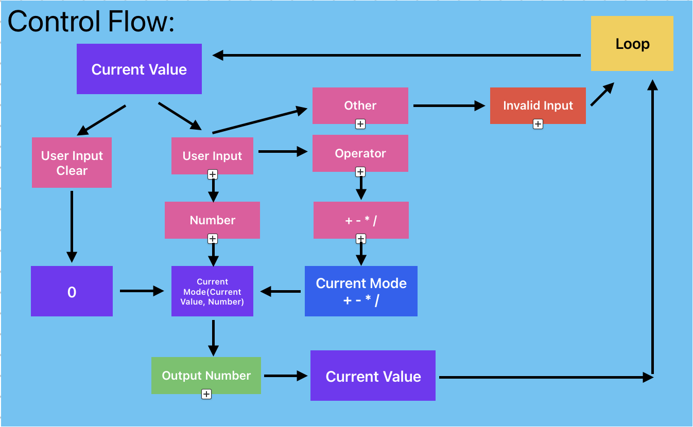

# JCalc

**Specification:**

Simple C++ command line tool that allows users to perform arithmetic calculations.

Must be written using a Test Driven Development methodology in an object oriented coding style to practice building a fully tested multi-file C++ program.

**Installation:**

Dependancies:
  - Boost.Test (header mode)
  https://github.com/boostorg/test

**User Stories:**

| **Story ID** | **As a user I want to:** | **So that I can:** |
| --- | --- | --- |
| 1 | Add two integers together | See the resulting sum |
| 2 | Subtract two integers from one another | See the resulting difference |
| 3 | Multiply two integers together | See the resulting product |
| 4 | Divide one integer by another | See the resulting quotient |

**Design:**

